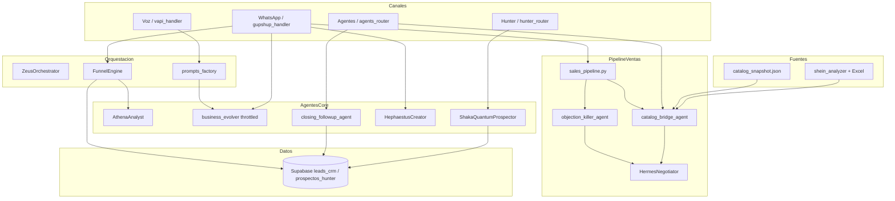
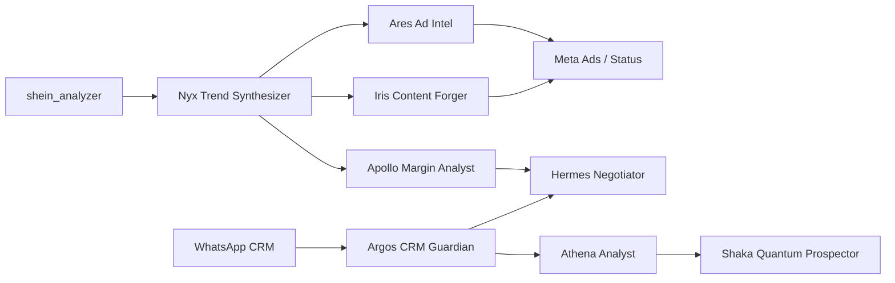

# Documentación de Arquitectura — Super Vendedor / ED NET PRO

> **Versión del documento:** 2.0  
> **Fecha:** Julio 2026  
> **Alcance:** `app/agents/`, `app/hunter/`, `shein_analyzer/`, `app/marketing/`, `app/sales_pipeline.py`  
> **Repositorio:** `supervendedor-core-ednetpro`  
> **Última refactorización:** Cableado integral — 11 agentes activos, catálogo Shein → Hermes ZOPA dinámica

---

## Tabla de contenidos

1. [Resumen ejecutivo](#1-resumen-ejecutivo)
2. [Mapa del ecosistema](#2-mapa-del-ecosistema)
3. [Cuadro de agentes (`app/agents/`)](#3-cuadro-de-agentes-appagents)
4. [Módulos satélite](#4-módulos-satélite)
5. [Flujos operativos actuales](#5-flujos-operativos-actuales)
6. [Evaluación de potencia y arquitectura](#6-evaluación-de-potencia-y-arquitectura)
7. [Brecha Shein ↔ Agentes de venta](#7-brecha-shein--agentes-de-venta)
8. [Propuesta de nuevos agentes (5)](#8-propuesta-de-nuevos-agentes-5)
9. [Prioridad de implementación](#9-prioridad-de-implementación)
10. [Ejemplos de código e integración](#10-ejemplos-de-código-e-integración)
11. [Conclusión y próximos pasos](#11-conclusión-y-próximos-pasos)
12. [Endpoints API actualizados](#12-endpoints-api-actualizados)
13. [Variables de entorno nuevas](#13-variables-de-entorno-nuevas)

---

## 1. Resumen ejecutivo

**Super Vendedor v2** es un ecosistema **cableado de extremo a extremo**: catálogo Shein alimenta precios ZOPA dinámicos, Hunter evalúa leads con Shaka, WhatsApp integra Hephaestus + Objection Killer + Hermes, y un scheduler reactiva leads estancados.

| Capa | Estado v2 |
|------|-----------|
| **Embudo WhatsApp** | ✅ Catalog Bridge → Objection Killer → Hermes (sin precios hardcoded) |
| **Hunter B2B** | ✅ Shaka `probability_score` antes de Supabase |
| **Creativos bajo demanda** | ✅ Hephaestus (ficha + imagen Shein + propuesta) |
| **CRM Followup** | ✅ Scheduler async 6h + endpoint manual |
| **Shein → Ventas** | ✅ `catalog_bridge_agent` + `/agents/catalog/*` |
| **Cronos Evolution** | ⚠️ Deprecado conceptualmente (usar `business_evolver`) |

---

## 2. Mapa del ecosistema

### 2.1 Diagrama de arquitectura (Mermaid)



### 2.2 Leyenda

| Símbolo | Significado |
|---------|-------------|
| `-->` | Conexión activa en producción |
| `-.->` | Conexión ausente o solo conceptual |
| **Zeus** | Orquestador genérico en `app/orchestrator.py` (no vive en `app/agents/`) |

---

## 3. Cuadro de los 11 agentes activos

| # | Agente | Archivo | Rol | Inputs | Outputs | Conectado en |
|---|--------|---------|-----|--------|---------|--------------|
| 1 | **Prompts Factory** | `prompts_factory.py` | System prompts Vapi + dynamic_knowledge | `client_id` | `(prompt, modo)` | Vapi |
| 2 | **Business Evolver** | `business_evolver.py` | Evolución post-llamada | leads, feedback | `dynamic_knowledge` JSON | Vapi + WhatsApp (throttled 30min) |
| 3 | **Athena Analyst** | `athena_analyst.py` | Sentimiento + momentum | texto, timestamps | HOT/WARM/CHURN | WhatsApp Nivel 1 |
| 4 | **Hermes Negotiator** | `hermes_negotiator.py` | ZOPA + cierre persuasivo | target/reserve dinámicos | contraoferta + texto | `sales_pipeline.py` |
| 5 | **Shaka Quantum Prospector** | `shaka_quantum_prospector.py` | probability_score + canal | prospecto Hunter | score, channel, opening_line | Hunter campaña |
| 6 | **Hephaestus Creator** | `hephaestus_creator.py` | Ficha visual + propuesta | mensaje catálogo | text, image_url, file | WhatsApp on-demand |
| 7 | **Catalog Bridge (Nyx)** | `catalog_bridge_agent.py` | Excel/JSON Shein → ZOPA | Excel, scraper | target_price, reserve_price | Hermes + Hephaestus |
| 8 | **Objection Killer** | `objection_killer_agent.py` | Objeciones complejas | mensaje + zopa | respuesta + precio autorizado | `sales_pipeline.py` |
| 9 | **Closing Followup** | `closing_followup_agent.py` | Reactivación CRM | leads stale Supabase | WhatsApp reactivación | Scheduler startup |
| 10 | **Zeus Orchestrator** | `app/orchestrator.py` | Chat genérico | mensaje, historial | respuesta LLM | WhatsApp prospecto |
| 11 | **Funnel Engine** | `app/funnel.py` | Embudo 5 niveles | teléfono, etapa | estado CRM | WhatsApp |

> **Nota:** `cronos_evolution.py` permanece en repo pero **no se usa** — reemplazado por `business_evolver`.

### 3.1 Detalle por agente

#### Prompts Factory (`prompts_factory.py`)

- **Prioridad de fuentes:** Supabase `custom_prompt` → plantilla por `modo_operacion` → S3 → default.
- **Inyección:** `_inject_dynamic_knowledge()` añade aprendizaje de `business_evolver` al final del prompt.
- **Función pública:** `get_system_prompt(client_id) -> tuple[str, str]`

#### Business Evolver (`business_evolver.py`)

- **Trigger:** `evolve_business_logic(client_id, tenant_id, n_llamadas)` en background tras `end-of-call-report`.
- **Fuentes:** `leads_crm` (Supabase) + `feedback.txt` local.
- **Motor IA:** Claude Sonnet → Groq Llama3 → fallback estático.
- **Destino:** `clients_config.dynamic_knowledge` en Supabase.

#### Athena Analyst (`athena_analyst.py`)

- **Motores:** Gemini Flash → Claude Haiku → Groq → heurística por palabras clave.
- **Fórmula:** `momentum = sentiment × velocity`
- **Umbrales:** `> 0.65` HOT | `< 0.25` CHURN | resto WARM.

#### Hermes Negotiator (`hermes_negotiator.py`)

- **ZOPA:** Acepta si `user_offer >= target`; contraoferta si está entre reserve y target; concesión mínima si está bajo reserve.
- **Motores verbales:** Claude Sonnet → Groq → Gemini → plantilla fija.

#### Shaka Quantum Prospector (`shaka_quantum_prospector.py`)

- Diseñado para scoring probabilístico y línea de apertura por canal.
- **Problema técnico:** depende de Vertex AI legacy; falta `import json` en algunas rutas.
- **Estado:** código presente, cero imports en routers.

#### Hephaestus Creator (`hephaestus_creator.py`)

- Generación de imagen (Vertex Imagen) y PDF de propuesta.
- **Estado:** no referenciado por `gupshup_handler`, `vapi_handler` ni `main.py`.

#### Cronos Evolution (`cronos_evolution.py`)

- Evolución genética de scripts (crossover + mutación).
- **Conflicto conceptual:** compite con `business_evolver`, que ya cumple evolución activa.
- **Problema técnico:** clase duplicada dentro del mismo archivo.

---

## 4. Módulos satélite

| Módulo | Ubicación | Rol | Inputs | Outputs | Integración |
|--------|-----------|-----|--------|---------|-------------|
| **ZeusOrchestrator** | `app/orchestrator.py` | LLM genérico (Groq → Claude) para conversación libre | `user_message`, `client_id`, historial | `{type: "text", content}` | ✅ WhatsApp |
| **FunnelEngine** | `app/funnel.py` | Embudo gamificado 5 niveles | `telefono`, etapa | `estado` en `leads_crm` | ✅ WhatsApp |
| **Hunter / ProspectingEngine** | `app/hunter/prospecting_engine.py` | Prospección B2B Google Maps + scoring + Gemini | `query`, `ciudad`, `tenant_id` | `prospectos_hunter` | ✅ `/hunter/*` |
| **shein_analyzer** | `shein_analyzer/scraper.py` | Scrape tendencias Shein CO (enterizos deportivos) | Playwright, límite N | Excel + `SheinProduct[]` | ❌ Standalone CLI |
| **meta_api** | `app/marketing/meta_api.py` | Métricas y pausa de campañas Meta | Token, ad account ID | Insights Meta API | ❌ Solo `test_meta.py` |
| **spy_workers** | `spy_workers.py` (raíz) | Google Trends + Meta Ad Library → PocketBase | keywords, page_id | Registros tendencias/ads | ❌ Script desconectado |
| **ai_copywriter** | `ai_copywriter.py` (raíz) | Adapta copy competencia vía Ollama local | Texto anuncio Meta | Copy en español CO | ❌ Standalone |
| **media_generation** | `app/routers/media_generation.py` | Video Veo 3.1 + Imagen Gemini | prompts | URIs/base64 | ❌ No montado en `main.py` |

### 4.1 Hunter — Endpoints REST

| Método | Ruta | Descripción |
|--------|------|-------------|
| `POST` | `/hunter/campana` | Ejecuta campaña Google Maps |
| `GET` | `/hunter/leads-calientes` | Leads con score ≥ 7 |
| `GET` | `/hunter/prospectos` | Lista prospectos |
| `PATCH` | `/hunter/prospectos/{id}/procesado` | Marca prospecto procesado |

### 4.2 Shein Analyzer — Comando de ejecución

```powershell
pip install -r requirements.txt
playwright install chromium
python -m shein_analyzer.scraper
```

**Salida:** `shein_enterizos_deportivos.xlsx` en la raíz del proyecto.

**Variables de entorno relevantes:**

| Variable | Default | Descripción |
|----------|---------|-------------|
| `SHEIN_HEADLESS` | `false` | Navegador visible (mejor anti-bot) |
| `SHEIN_CAPTCHA_WAIT_S` | `60` | Segundos de espera manual CAPTCHA |
| `SHEIN_SCRAPE_LIMIT` | `30` | Máximo productos a extraer |
| `SHEIN_USER_DATA_DIR` | `.shein_browser_profile` | Perfil persistente Chrome |

---

## 5. Flujos operativos actuales

### 5.1 Canal WhatsApp (`gupshup_handler.py`) — v2

```
Mensaje entrante
  → touch updated_at (anti-followup redundante)
  → Hephaestus? (catálogo/imagen/PDF) → envío directo → FIN
  → FunnelEngine.get_stage(telefono)
  → PROSPECTO:  Athena → Zeus → CALIFICADO
  → CALIFICADO/NEGOCIANDO:
       sales_pipeline.negotiate_response()
         → catalog_bridge.get_zopa_for_message()
         → objection_killer.handle()? → respuesta
         → HermesNegotiator ZOPA dinámica
  → AGENDA: Google Calendar → CERRADO
  → Background: business_evolver (máx 1/30min)
```

**Embudo (FunnelEngine):**

```
PROSPECTO → CALIFICADO → NEGOCIANDO → AGENDA_PENDIENTE → CERRADO
```

### 5.2 Canal Voz (`vapi_handler.py`)

```
assistant-request → prompts_factory.get_system_prompt(client_id)
tool-calls        → agendar_cita → Google Calendar
end-of-call       → extract_missed_info + business_evolver (background)
```

### 5.3 Canal Hunter (`hunter_router.py`)

```
POST /hunter/campana → ProspectingEngine → Google Maps → score → prospectos_hunter
GET  /hunter/leads-calientes → filtro score >= 7
```

### 5.4 Shein Analyzer (paralelo, sin puente)

```
python -m shein_analyzer.scraper → Excel en raíz → fin
```

---

## 6. Evaluación de potencia y arquitectura

### 6.1 Fortalezas

| Área | Evaluación |
|------|------------|
| **Embudo WhatsApp** | Claro y gamificado; Athena + Hermes + Funnel encadenados de forma legible. |
| **Voz (Vapi)** | `prompts_factory` + `business_evolver` forman un loop de mejora continua real. |
| **Multi-motor IA** | Fallbacks Gemini/Claude/Groq en Athena/Hermes/Zeus reducen dependencia de una sola API. |
| **Hunter B2B** | Motor completo: Maps → scoring → Supabase → API REST. |
| **Shein scraper** | Módulo maduro (anti-bot, Excel, parseo COP) como fuente de inteligencia de catálogo. |

### 6.2 Debilidades críticas

| Problema | Impacto |
|----------|---------|
| **Agentes huérfanos** | Shaka, Hephaestus y Cronos no están cableados; Cronos tiene código duplicado y depende de Vertex AI legacy. |
| **Shein ↔ Ventas desconectados** | Tendencias/precios/imágenes no alimentan Hermes, prompts ni Meta Ads. |
| **Precios hardcoded en Hermes** | `target_price=500`, `reserve_price=300` en WhatsApp ignoran catálogo Shein real. |
| **Dos motores de evolución** | `business_evolver` (activo) vs `cronos_evolution` (inactivo) compiten conceptualmente. |
| **Marketing fragmentado** | `meta_api`, `spy_workers`, `ai_copywriter` y `shein_analyzer` viven en islas sin router unificado. |
| **Zeus vs agentes especializados** | Zeus responde en PROSPECTO aunque Athena diga CHURN_RISK; no hay handoff estructurado a Shaka/Hunter. |
| **Sin orquestador central** | No hay un “director” que decida qué agente actúa; la lógica está repartida en routers. |

### 6.3 Problemas técnicos detectados

| Archivo | Problema |
|---------|----------|
| `shaka_quantum_prospector.py` | Vertex AI legacy; falta `import json` |
| `cronos_evolution.py` | Clase duplicada en el mismo archivo |
| `app/hunter/__init__.py` | Stub diferente al `ProspectingEngine` real |
| `ai_copywriter.py` | Falta `import requests` |
| `media_generation.py` | Router no incluido en `app/main.py` |

---

## 7. Brecha Shein ↔ Agentes de venta

### 7.1 Diagrama de desconexión

```
shein_analyzer ──X──> Hermes (precios ZOPA)
                ──X──> prompts_factory (productos_servicios dinámicos)
                ──X──> Hephaestus / media_generation (creativos)
                ──X──> meta_api (pauta de productos trending)
                ──X──> Hunter / Shaka (prospección de revendedores)
```

### 7.2 Impacto de negocio

Hoy el Excel `shein_enterizos_deportivos.xlsx` es el **único artefacto de negocio** del scraper. No existe pipeline hacia:

- Supabase (`trend_snapshots`, `clients_config`)
- Variables dinámicas en prompts de Vapi
- Precios ZOPA de Hermes en WhatsApp
- Creativos para Meta Ads o WhatsApp Status

---

## 8. Propuesta de nuevos agentes (5)

Nomenclatura alineada con mitología + rol funcional, coherente con Athena, Hermes, Hephaestus y Cronos.

---

### 8.1 Nyx Trend Synthesizer

**Archivo propuesto:** `app/agents/nyx_trend_synthesizer.py`

| Campo | Detalle |
|-------|---------|
| **Deidad / metáfora** | Nyx — la noche que envuelve y sintetiza señales ocultas del mercado |
| **Rol** | Puente entre **Shein Analyzer** y el resto del sistema. Normaliza Excel/JSON de productos trending, calcula ranking por precio/popularidad, publica snapshot en Supabase o inyecta variables en `clients_config`. |
| **Inputs** | `SheinProduct[]` o path al Excel; categoría; fecha |
| **Outputs** | `{top_products[], avg_price, price_range, hot_keywords[], catalog_summary}` |

**Interacciones:**

| Agente | Cómo interactúa |
|--------|-----------------|
| **Hermes** | Provee `target_price` y `reserve_price` dinámicos por producto (ej. Shein COP × margen revendedor 2.2×). |
| **Athena** | Enriquece contexto: “prospecto preguntó por enterizo X que está en top 3 Shein”. |
| **Shaka** | Alimenta `lead_data.past_interest` con SKU trending para subir probabilidad inicial. |

---

### 8.2 Apollo Margin Analyst

**Archivo propuesto:** `app/agents/apollo_margin_analyst.py`

| Campo | Detalle |
|-------|---------|
| **Deidad / metáfora** | Apolo — claridad, precisión y luz sobre números |
| **Rol** | Analista de **margen y precio** para revendedores (PCO Cúcuta). Compara precio Shein vs reventa sugerida, costo logístico y break-even. |
| **Inputs** | Precio COP Shein, costo envío, % margen objetivo, competencia local opcional |
| **Outputs** | `{precio_reventa, margen_bruto, margen_pct, precio_piso, precio_techo, recomendacion_hermes}` |

**Interacciones:**

| Agente | Cómo interactúa |
|--------|-----------------|
| **Hermes** | Sustituye precios fijos: entrega `target_price` / `reserve_price` calculados por SKU. |
| **Athena** | Si el prospecto negocia bajo el piso → `CHURN_RISK` o cambio de estrategia. |
| **Shaka** | Ajusta `probability_score` según margen atractivo del catálogo del día. |

---

### 8.3 Iris Content Forger

**Archivo propuesto:** `app/agents/iris_content_forger.py`

| Campo | Detalle |
|-------|---------|
| **Deidad / metáfora** | Iris — mensajera; lleva el producto al mundo visual |
| **Rol** | Generación de **contenido visual y copy** para WhatsApp Status, Facebook Ads e Instagram, basado en productos trending. Evolución integrada de Hephaestus + `media_generation` + `ai_copywriter`. |
| **Inputs** | Producto trending (título, imagen URL, precio), tono (`urgente`, `confianza`, `moda`), CTA (“Pago contra entrega Cúcuta”) |
| **Outputs** | `{copy_whatsapp, copy_meta_ad, image_prompt, optional_video_prompt}` |

**Interacciones:**

| Agente | Cómo interactúa |
|--------|-----------------|
| **Hermes** | Genera ganchos de apertura alineados con la contraoferta del momento. |
| **Athena** | Adapta tono según momentum del lead (más directo si HOT). |
| **Shaka** | Produce el `opening_line` real en lugar del placeholder de Vertex. |

---

### 8.4 Argos CRM Guardian

**Archivo propuesto:** `app/agents/argos_crm_guardian.py`

| Campo | Detalle |
|-------|---------|
| **Deidad / metáfora** | Argos — el guardián de muchos ojos |
| **Rol** | **Guardián CRM WhatsApp**: monitorea conversaciones estancadas, re-engagement, SLA de respuesta y sincronización `leads_crm` ↔ embudo. |
| **Inputs** | `telefono`, historial, `estado` funnel, última interacción, producto de interés |
| **Outputs** | `{accion: follow_up | escalar_hermes | descartar, mensaje_sugerido, nuevo_lead_score}` |

**Interacciones:**

| Agente | Cómo interactúa |
|--------|-----------------|
| **Hermes** | Escala a negociación cuando detecta objeción de precio repetida. |
| **Athena** | Re-evalúa momentum en conversaciones frías (>24 h sin respuesta). |
| **Shaka** | Re-asigna canal (WhatsApp vs llamada Vapi) según probabilidad recalculada. |

---

### 8.5 Ares Ad Intel

**Archivo propuesto:** `app/agents/ares_ad_intel.py`

| Campo | Detalle |
|-------|---------|
| **Deidad / metáfora** | Ares — guerra publicitaria competitiva |
| **Rol** | **Inteligencia publicitaria**: une `meta_api`, `spy_workers` y tendencias Shein. Detecta qué pauta la competencia, qué producto trendear y si pausar/escalar campañas. |
| **Inputs** | Meta token, ad account, keywords, snapshot Nyx (productos top) |
| **Outputs** | `{ads_activos[], productos_a_pautar[], copy_sugerido, accion: pausar|escalar}` |

**Interacciones:**

| Agente | Cómo interactúa |
|--------|-----------------|
| **Hermes** | Alinea mensajes de cierre con el ángulo del anuncio que trajo el lead. |
| **Athena** | Correlaciona calidad de leads por campaña vs sentiment. |
| **Shaka** | Enriquece `source` del lead (“Instagram Ad — enterizo #3 trending”) para mejor scoring. |

---

### 8.6 Mapa de agentes propuestos vs existentes



---

## 9. Prioridad de implementación

| Prioridad | Agente | Por qué |
|-----------|--------|---------|
| 🔴 **Alta** | **Nyx Trend Synthesizer** | Cierra la brecha Shein ↔ todo lo demás con poco código. |
| 🔴 **Alta** | **Apollo Margin Analyst** | Elimina precios hardcoded de Hermes; impacto directo en ventas. |
| 🟡 **Media** | **Iris Content Forger** | Activa marketing + Hephaestus dormant con ROI visible. |
| 🟡 **Media** | **Argos CRM Guardian** | Reduce leads perdidos en WhatsApp. |
| 🟢 **Baja** | **Ares Ad Intel** | Requiere Meta API estable + unión con spy_workers. |

### 9.1 Roadmap sugerido (3 fases)

| Fase | Entregables | Duración estimada |
|------|-------------|-------------------|
| **Fase 1** | Nyx + router `/trends/shein` + Apollo en Hermes | 1–2 sprints |
| **Fase 2** | Iris + montar `media_generation` en `main.py` | 1 sprint |
| **Fase 3** | Argos + Ares + cablear Shaka | 2 sprints |

---

## 10. Ejemplos de código e integración

### 10.1 Uso actual de Athena + Hermes en WhatsApp (referencia)

```python
# app/routers/gupshup_handler.py (patrón simplificado)
from app.agents.athena_analyst import AthenaAnalyst
from app.agents.hermes_negotiator import HermesNegotiator

athena = AthenaAnalyst()
momentum = athena.get_sales_momentum(
    last_user_message=texto,
    last_interaction_time=ultima_hora_bot,
    current_time=datetime.now(),
)

# ⚠️ PROBLEMA ACTUAL: precios fijos, no vienen de Shein
hermes = HermesNegotiator(target_price=500.0, reserve_price=300.0)
decision = hermes.calculate_counter_offer(user_offer=450.0)
respuesta = hermes.generate_response(decision)
```

### 10.2 Propuesta: Hermes alimentado por Apollo (futuro)

```python
# app/agents/apollo_margin_analyst.py (esqueleto propuesto)
from dataclasses import dataclass

@dataclass
class MargenProducto:
    precio_shein_cop: float
    costo_envio: float
    margen_objetivo_pct: float = 120.0  # 2.2x sobre Shein

    def calcular_zona_hermes(self) -> dict:
        precio_reventa = self.precio_shein_cop * (1 + self.margen_objetivo_pct / 100)
        precio_piso    = self.precio_shein_cop + self.costo_envio + 15_000
        return {
            "target_price":  round(precio_reventa, 0),
            "reserve_price": round(precio_piso, 0),
            "margen_bruto":  round(precio_reventa - self.precio_shein_cop - self.costo_envio, 0),
        }


# Uso en gupshup_handler (reemplaza 500/300 hardcoded)
from app.agents.apollo_margin_analyst import MargenProducto
from app.agents.hermes_negotiator import HermesNegotiator

zona = MargenProducto(precio_shein_cop=45_990, costo_envio=8_000).calcular_zona_hermes()
hermes = HermesNegotiator(
    target_price=zona["target_price"],
    reserve_price=zona["reserve_price"],
)
```

### 10.3 Propuesta: Nyx leyendo el Excel de Shein

```python
# app/agents/nyx_trend_synthesizer.py (esqueleto propuesto)
from pathlib import Path
from openpyxl import load_workbook

def synthesize_from_excel(path: str | Path) -> dict:
    wb = load_workbook(path, read_only=True)
    ws = wb.active
    products = []
    for row in ws.iter_rows(min_row=2, values_only=True):
        idx, titulo, precio, img_url, prod_url, fecha = row[:6]
        if not titulo or not precio:
            continue
        products.append({
            "titulo": str(titulo),
            "precio_cop": float(precio) if isinstance(precio, (int, float)) else 0,
            "url": str(prod_url or ""),
            "imagen": str(img_url or ""),
        })
    wb.close()

    precios = [p["precio_cop"] for p in products if p["precio_cop"] > 0]
    top = sorted(products, key=lambda p: p["precio_cop"])[:5]

    return {
        "top_products": top,
        "avg_price": sum(precios) / len(precios) if precios else 0,
        "price_range": {"min": min(precios), "max": max(precios)} if precios else {},
        "hot_keywords": _extract_keywords([p["titulo"] for p in top]),
        "catalog_summary": f"{len(products)} productos analizados",
    }
```

### 10.4 Propuesta: Router FastAPI `/trends/shein`

```python
# app/routers/trends_router.py (propuesto)
from fastapi import APIRouter, BackgroundTasks
from pathlib import Path

router = APIRouter(prefix="/trends", tags=["trends"])

EXCEL_DEFAULT = Path("shein_enterizos_deportivos.xlsx")

@router.post("/shein/scrape")
async def scrape_shein(background_tasks: BackgroundTasks):
    """Ejecuta scraper y regenera Excel."""
    from shein_analyzer.scraper import scrape_enterizos_deportivos
    background_tasks.add_task(scrape_enterizos_deportivos, save_excel=True)
    return {"status": "started", "output": str(EXCEL_DEFAULT)}

@router.get("/shein/snapshot")
async def shein_snapshot():
    """Devuelve síntesis Nyx del último Excel."""
    from app.agents.nyx_trend_synthesizer import synthesize_from_excel
    if not EXCEL_DEFAULT.exists():
        return {"error": "Ejecuta POST /trends/shein/scrape primero"}
    return synthesize_from_excel(EXCEL_DEFAULT)
```

**Montaje en `app/main.py`:**

```python
from app.routers.trends_router import router as trends_router

app.include_router(trends_router)
```

### 10.5 Propuesta: Iris generando copy para WhatsApp Status

```python
# app/agents/iris_content_forger.py (esqueleto propuesto)
def forge_whatsapp_copy(producto: dict, tono: str = "urgente") -> str:
    titulo = producto["titulo"]
    precio = producto.get("precio_reventa") or producto["precio_cop"]
    prompt = f"""
    Eres copywriter de ropa deportiva estilo Shein en Cúcuta, Colombia.
    Producto: {titulo}
    Precio: ${precio:,.0f} COP — Pago contra entrega.
    Tono: {tono}
    Escribe un texto de máximo 3 líneas con emojis, listo para WhatsApp Status.
    """
    # Reutilizar cadena Gemini/Claude de Hermes o ai_copywriter
    return _call_llm(prompt)
```

### 10.6 Business Evolver — trigger en Vapi (actual)

```python
# app/routers/vapi_handler.py (extracto real)
from app.agents.business_evolver import evolve_business_logic

background_tasks.add_task(evolve_business_logic, client_id, client_id, 10)
```

### 10.7 Prompts Factory — inyección de knowledge (actual)

```python
# app/agents/prompts_factory.py
def get_system_prompt(client_id: str) -> tuple[str, str]:
    """
    Retorna (system_prompt, modo_operacion).
    Inyecta dynamic_knowledge de business_evolver al final del prompt.
    """
    # ... lógica Supabase / S3 / default ...
    prompt = _inject_dynamic_knowledge(prompt, config, client_id)
    return prompt, modo
```

---

## 11. Conclusión y próximos pasos

### 11.1 Conclusión ejecutiva

**Super Vendedor** hoy es un **sistema híbrido**:

- El embudo **WhatsApp + Vapi + Business Evolver** forma un núcleo de ventas conversacional **sólido y en producción**.
- La **inteligencia de mercado** (Shein, Meta, Trends) y **tres agentes mitológicos** (Shaka, Hephaestus, Cronos) están **construidos pero no participan del flujo**.

La mayor palanca inmediata **no es crear más agentes desde cero**, sino:

1. **Cablear Nyx** entre `shein_analyzer` y Hermes/prompts.
2. **Retirar precios fijos** de `gupshup_handler.py` y usar **Apollo**.
3. **Registrar** `shein_analyzer` y `meta_api` como routers FastAPI (`/trends`, `/marketing`) en `app/main.py`.

Con eso se pasa de un scraper aislado a un **motor de catálogo dinámico** que alimenta negociación, contenido y pauta — coherente con el modelo de negocio de ropa estilo Shein con pago contra entrega en Cúcuta.

### 11.2 Checklist v2 (completado / pendiente)

- [x] Crear `catalog_bridge_agent.py` (Nyx Bridge)
- [x] Crear `objection_killer_agent.py`
- [x] Crear `closing_followup_agent.py`
- [x] Cablear Shaka en Hunter → Supabase
- [x] Cablear Hephaestus en WhatsApp
- [x] Eliminar precios hardcoded — usar `sales_pipeline.py`
- [x] Router `/agents/*` en `main.py`
- [x] Scheduler followup en startup
- [ ] Activar `media_generation` router
- [ ] Unificar `meta_api` + spy_workers (Ares Ad Intel)
- [ ] Deprecar formalmente `cronos_evolution.py`

### 11.3 Referencias de archivos clave

| Ruta | Propósito |
|------|-----------|
| `app/sales_pipeline.py` | Orquestación Catalog → Objection → Hermes |
| `app/agents/catalog_bridge_agent.py` | Nyx Bridge — Shein → ZOPA |
| `app/agents/objection_killer_agent.py` | Manejo de objeciones |
| `app/agents/closing_followup_agent.py` | CRM Guardian / followup |
| `app/agents/shaka_quantum_prospector.py` | Scoring Hunter |
| `app/agents/hephaestus_creator.py` | Creativos catálogo |
| `app/services/whatsapp_sender.py` | Envío centralizado WhatsApp |
| `app/routers/agents_router.py` | API catálogo + followup + shein |
| `app/routers/gupshup_handler.py` | WhatsApp integrado |
| `app/routers/hunter_router.py` | Hunter + Shaka preview |
| `app/main.py` | Registro routers + startup scheduler |

---

## 12. Endpoints API actualizados

### Base

| Método | Ruta | Descripción |
|--------|------|-------------|
| `GET` | `/` | Status sistema + 11 agentes |
| `GET` | `/health` | Health check |

### WhatsApp

| Método | Ruta | Descripción |
|--------|------|-------------|
| `POST` | `/whatsapp/webhook` | Webhook Evolution API |

### Hunter

| Método | Ruta | Descripción |
|--------|------|-------------|
| `POST` | `/hunter/campana` | Campaña Maps + Shaka score |
| `GET` | `/hunter/leads-calientes` | Leads score ≥ 7 |
| `GET` | `/hunter/prospectos` | Lista prospectos |
| `POST` | `/hunter/shaka/score` | Preview probability_score |
| `PATCH` | `/hunter/prospectos/{id}/procesado` | Marcar procesado |

### Agentes / Catálogo

| Método | Ruta | Descripción |
|--------|------|-------------|
| `GET` | `/agents/catalog/snapshot` | Productos + ZOPA + summary |
| `POST` | `/agents/catalog/refresh` | Recargar desde Excel/cache |
| `GET` | `/agents/catalog/zopa?q=` | ZOPA por query producto |
| `POST` | `/agents/followup/run` | Ejecutar ciclo reactivación |
| `POST` | `/agents/shein/scrape` | Scrape Shein + ingerir catálogo |
| `GET` | `/agents/health` | Estado agentes cableados |

---

## 13. Variables de entorno nuevas

| Variable | Default | Descripción |
|----------|---------|-------------|
| `CATALOG_MARGEN_PCT` | `120` | Margen % sobre precio Shein |
| `CATALOG_COSTO_ENVIO` | `8000` | Costo envío COP |
| `CATALOG_MARGEN_MINIMO` | `15000` | Margen mínimo COP sobre Shein |
| `FOLLOWUP_STALE_HOURS` | `18` | Horas sin actividad → reactivar |
| `FOLLOWUP_INTERVAL_HOURS` | `6` | Intervalo scheduler |
| `FOLLOWUP_SCHEDULER_ENABLED` | `true` | Activar scheduler en startup |
| `LOCAL_STORAGE_DIR` | `app/storage_vault` | Cache catálogo + creativos |

---

*Documento generado como referencia de arquitectura para el equipo ED NET PRO / Super Vendedor.*
